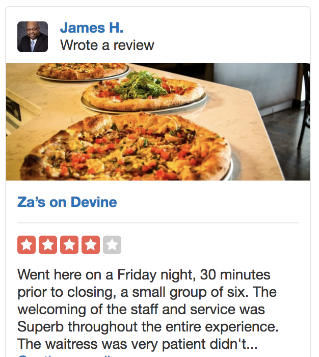
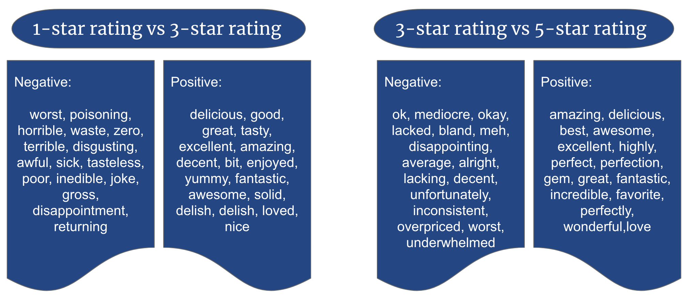

Jupyter Notebook Untitled Last Checkpoint: 2 hours ago (autosaved) Python 3
Python 3 
File
Edit
View
Insert
Cell
Kernel
Widgets
Help

 
# Quantifying customers dining experience with NLP
​
##### Galvanize Data Science Immersive Capstone (In Progress)
​
 
​
### Motivation

A study from Cornell University conducted in 2005 <a href="https://www.researchgate.net/publication/237835565_Why_Restaurants_Fail"><i>Why restaurants fail</i></a> found that 26.16 percent of independent restaurants failed during the first year of operation. Another recent study in 2014 <a href="https://www.researchgate.net/publication/267695784_Only_the_Bad_Die_Young_Restaurant_Mortality_in_the_Western_US"><i>Only the Bad Die Young: Restaurant Mortality in the Western US</i></a> also found that the restaurant franchize have actually improved a bit to 17 percent of independently owned full-service restaurant startups failing in their first year. One of the factors that affect retaurants from being successful is the inability to identify aspects of their services impacting customers satisfaction.

​
​
### Overview

The availability of online review web services have made it relatively easy for restaurant patrons to get information about a retaurant before deciding to dinning there. Yelp is a popular review online service for restaurants and other businesses. This presents an opportunity for these restaurants to use these feedbacks to measure their customer satisfaction performance and improve on poorly performed aspects of their services. Most restaurants rely on star ratings to measure customer satisfaction, but star rating does not necessarily reveal the cause of a customer's satisfaction/dissatisfaction. This project focuses on using natural language processing (NLP) to analyze user reviews text to extract aspects of restaurants services that impact its customers. 
In other to get anticipated results out of this modelling, it should answer the following questions:
  <ul>
    <li>
      What are the factors responsible for a customers dining experience falling on the far opposite ends of satisfaction ?
    </li>
    <li>
      What stops a customer from who gives a 4-star rating from giving a 5-star ?
    </li>
    <li>
      What distinguishes a great restaurants service from a 3-star restaurants service ?
    </li>
    <li>
      How does the tone in review text change across review star ratings ?
    </li>
  </ul>
​
   
   
  
             
<figcaption>Figure 1</figcaption>
 

​
​
​
### Datasets

Three sets of data was collected from <a href="https://www.yelp.com/dataset/challenge">yelp</a>, which is a publicly available dataset. The datasets are as follows:
  <ul>
  <li>Business dataset that describes all sorts of businesses that provide services to the general public. The            dataset has 174,567 records and a size of 145.2 MB.</li>
  <li>Review dataset is a records customer reviews of differnt business in the business dataset collected. The dataset holds 5,261,669 records and has a size of 4.21 GB.</li>
  <li>User dataset holds the record of users who have given reviews and businesses they reviewed. The user data has 1,326,101 records and a size of 1.9 GB.</li>
  </ul>
  The datasets were stored in AWS s3 bucket, and due to the size of the data, I was unable to do the computation on a local machine. I used AWS SageMaker instance running on EC2 and Elastic File Storage (EFS) for most of the data munging and model training.

 
​
### Methodology
​
#### Data Cleaning

  <ul>
    <li>Step 1: Joining data sources.  
    The The three categories of data had some feature name that were nnot unique to it, and had to be renamed. The datasets had reviews records from both the US and other countries and had to be filtered to retain reviews for restaurants in US states alone and all three tables were joined on *business_id and user_id*. Exploring the data further shows 95.91 percent of the US data came from five states. I used the data for the five states for modelling and validation and the rest of the 4.09 percent of the data for testing the web app which I will discuss in a later section. This process can be seen in <a href="sage_yelp.ipynb">sage_yelp.ipynb</a>.

<figcaption>Figure 2</figcaption>
  </li> 
  
  <li>Step 2. Tokenizer, Lemmatize, Regex.  
    I used two functions * clean_stem(corpus) * and *regex(word)* in <a href="util.py">util.py</a> to tokenize each review into list of words, remove stop words as they do not communicate important information about the context of the review and remove strings that are digits or have digits in them and lemmatize the words. This returns a corpus of documents ready to be vectorized.  
  </li>
  <li>Step 3. Term Frequency Inverse Document Frequency (TFIDF).  
  Before building a model, the reviews have to be transformed into numerical representation. I used the TFIDF to turn the corpus into word vectors. 
  </li>
</ul>

​
#### Models

  To answer the questions posed in the overview, I used Logistic Regression to model the data by 1-star vs all and 5-star vs all to classify the reviews to asociated ratings.
  <ul>
  <li>Model_12: 1-star rating vs 2-star rating</li>
  <li>Model_13: 1-star rating vs 3-star rating</li>
  <li>Model_14: 1-star rating vs 4-star rating</li>
  <li>Model_15: 1-star rating vs 5-star rating</li>
  <li>Model_52: 5-star rating vs 2-star rating</li>
  <li>Model_53: 5-star rating vs 3-star rating</li>
  <li>Model_54: 5-star rating vs 4-star rating</li>
  </ul>

​
### Results

  
  
  
  <figcaption>Figure 3</figcaption>
   
  The model behaves different per combination of rating. As the gap widens between ratings the accuracy inreases but decreases as the the gap tightens. Model_15 has highest accuracy, while Model_12 and Model_45 have the lowest accuracy. 
   
​
    
    <figcaption>Figure 4</figcaption>
 
  It is interesting to see that there is a distinct polarity in the connotation of adjectives used by customers to express their experience in the Model_15 on the left of figure 4, the wrds convey strong negative experience (ie. worst, horible, terible etc) and stong positive experience (ie. delicious, amazing great, etc). This is expected as people as usual comment amongst dinners. However, for Model_45 on the right of figure 4, strong postive adjective are used to describe positivity of the experience but the negative words convey a rather softer connotation and are more contextual in description (ie. lacked, deducted, slow etc which suggest that there are a few details in the aspect of service that prevents the restaurant being upto a five star rating).
  
  <figcaption>Figure 5</figcaption>
   
  Model_13 on the left of figure 5 shows the polarity in positivity like Model_15, this is interesting because with this model alone it can be assumed that the 3-star rating should be a five star rating since it bears hallmarks of a Model_15 but it turns out that, customers who gave had this much positive experience also had negative experience as seen in Model_35 on the right of figure 5. Model_13 extracts the positive experience of a 3-star retaurant, while Model_35 extracts the positivity of the 3-star restaurant.

​
​
### Web Application

Now that I have models that can extract aspects of a customers dinning experience, I built a web application using flask framework and bokeh to identify aspects of a restaurants service and how each aspect impact customers dinning experience using review text. This allows a restaurant franchize to know exactly how each aspeect of their service contribute to a customers satisfaction. The app takes the name of the resturant, the state of location, and the combination of star ratings. The result is a summarized analytics of the customers sentiments to each aspect of service.

 
<figcaption>Figure 6</figcaption>

​

​
